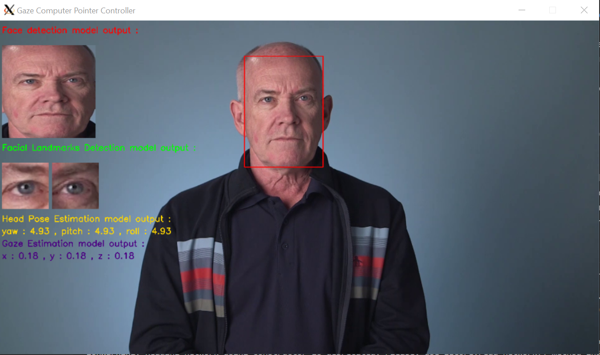

# Computer Pointer Controller

In this project, We use a [gaze detection model](https://docs.openvinotoolkit.org/latest/_models_intel_gaze_estimation_adas_0002_description_gaze_estimation_adas_0002.html) to control the mouse pointer of the computer. we will be using the Gaze Estimation model to estimate the gaze of the user's eyes and change the mouse pointer position accordingly. This project  demonstrates the ability to run multiple models in the same machine and coordinate the flow of data between those models.



We will be using the InferenceEngine API from Intel's OpenVino ToolKit to build the project. The gaze estimation model requires three inputs:

The head pose
The left eye image
The right eye image.

To get these inputs, we will have to use three other OpenVino models:

[Face Detection](https://docs.openvinotoolkit.org/latest/_models_intel_face_detection_adas_binary_0001_description_face_detection_adas_binary_0001.html)

[Head Pose Estimation](https://docs.openvinotoolkit.org/latest/_models_intel_head_pose_estimation_adas_0001_description_head_pose_estimation_adas_0001.html)

[Facial Landmarks Detection](https://docs.openvinotoolkit.org/latest/_models_intel_landmarks_regression_retail_0009_description_landmarks_regression_retail_0009.html)

### The Pipeline

We will have to coordinate the flow of data from the input, and then amongst the different models and finally to the mouse controller. The flow of data will look like this:


### Input

To do the gaze estimation, we'll need a video feed. we can either use a webcam stream as input to the model or, we can use the video file provided by Udacity (this is located in the bin folder of the starter files).

## Project Set Up and Installation

### Project Dependencies

#### OpenVINO™ Toolkit

Follow [the installation guide of the Intel® Distribution of OpenVINO™ toolkit for your OS](https://docs.openvinotoolkit.org/latest/)

#### virtual environment

A virtual environment is a silo-ed Python installation apart from your main Python installation. That way you can install packages and delete the virtual environment without affecting your main Python installation.

To create a virtual environment,use the following command : 

```
python3 -m venv environmentname
```

To create a virtual environment

```
source  environment/bin/activate
```

#### Required libraries

You can find the list of needed packages for this project in requirements.txt file.

You can install them by runniing the follwing command :

```
pip3 install -r requirements.txt
``` 
Please note that for the PyAutoGUI package you may need additional installations, depending on your OS, see the [documentation](https://pyautogui.readthedocs.io/en/latest/install.html)

### Project directory structure
```
├── bin
│   └── demo.mp4
├── models
│   └── intel
│       ├── face-detection-adas-binary-0001
│       │   └── FP32-INT1
│       │       ├── face-detection-adas-binary-0001.bin
│       │       └── face-detection-adas-binary-0001.xml
│       ├── gaze-estimation-adas-0002
│       │   ├── FP16
│       │   │   ├── gaze-estimation-adas-0002.bin
│       │   │   └── gaze-estimation-adas-0002.xml
│       │   ├── FP16-INT8
│       │   │   ├── gaze-estimation-adas-0002.bin
│       │   │   └── gaze-estimation-adas-0002.xml
│       │   └── FP32
│       │       ├── gaze-estimation-adas-0002.bin
│       │       └── gaze-estimation-adas-0002.xml
│       ├── head-pose-estimation-adas-0001
│       │   ├── FP16
│       │   │   ├── head-pose-estimation-adas-0001.bin
│       │   │   └── head-pose-estimation-adas-0001.xml
│       │   ├── FP16-INT8
│       │   │   ├── head-pose-estimation-adas-0001.bin
│       │   │   └── head-pose-estimation-adas-0001.xml
│       │   └── FP32
│       │       ├── head-pose-estimation-adas-0001.bin
│       │       └── head-pose-estimation-adas-0001.xml
│       └── landmarks-regression-retail-0009
│           ├── FP16
│           │   ├── landmarks-regression-retail-0009.bin
│           │   └── landmarks-regression-retail-0009.xml
│           ├── FP16-INT8
│           │   ├── landmarks-regression-retail-0009.bin
│           │   └── landmarks-regression-retail-0009.xml
│           └── FP32
│               ├── landmarks-regression-retail-0009.bin
│               └── landmarks-regression-retail-0009.xml
└── src
    ├── face_detection.py
    ├── facial_landmarks_detection.py
    ├── gaze_estimation.py
    ├── head_pose_estimation.py
    ├── input_feeder.py
    ├── main.py
    ├── mouse_controller.py
```

 * face_detection.py : 

   Class that loads the face detection model into the inference engine, check if there is any unsupported layer, preprocess the input, run inference, and preprocess the output. our goal here is to detect the face in the input frames and get the face cropped.

* facial_landmarks_detection.py : 

   Class that loads the facial landmarks detection model into the inference engine, check if there is any unsupported layer, preprocess the input, run inference, and preprocess the output. our goal here is to have the left and right eye coordinates and have them cropped from the face resulted from the "face_detection.py".

* head_pose_estimation.py :

    Class that loads the head pose estimation model into the inference engine, check if there is any unsupported layer, preprocess the input, run inference, and preprocess the output. our goal here is to get the pose angle of the head resulted from the "face_detection.py".

* gaze_estimation.py :

  Class that loads the gaze estimation model into the inference engine, check if there is any unsupported layer, preprocess the input, run inference, and preprocess the output. our goal here is to estimate the gaze of the user's eyes by feeding to the model, the left and right eye image and the head pose angle.

 
* input_feeder.py :

  Class that Streams input from an image, webcam, to be feed to our models.

* mouse_controller.py

  Class that we use to control the mouse pointer, It uses the pyautogui library.

* main.py : 

  The entry point of our application, it implements the inference data pipeline.

### Download the models

These can be downloaded using the model downloader. The models you will need are:

[Gaze Detection](https://docs.openvinotoolkit.org/latest/_models_intel_gaze_estimation_adas_0002_description_gaze_estimation_adas_0002.html)

[Face Detection](https://docs.openvinotoolkit.org/latest/_models_intel_face_detection_adas_binary_0001_description_face_detection_adas_binary_0001.html)

[Head Pose Estimation](https://docs.openvinotoolkit.org/latest/_models_intel_head_pose_estimation_adas_0001_description_head_pose_estimation_adas_0001.html)

[Facial Landmarks Detection](https://docs.openvinotoolkit.org/latest/_models_intel_landmarks_regression_retail_0009_description_landmarks_regression_retail_0009.html)

The followings are the commands to use to download each model, the files will be placed in the "models/" folder :

* face-detection-adas-binary-0001
```
python3 /opt/intel/openvino/deployment_tools/open_model_zoo/tools/downloader/downloader.py --name face-detection-adas-binary-0001  -o /path/to/your/workspace/computer_pointer_controller/models
```

* head-pose-estimation-adas-0001
```
python3 /opt/intel/openvino/deployment_tools/open_model_zoo/tools/downloader/downloader.py --name head-pose-estimation-adas-0001 -o /path/to/your/workspace/computer_pointer_controller/models
```

* landmarks-regression-retail-0009
```
python3 /opt/intel/openvino/deployment_tools/open_model_zoo/tools/downloader/downloader.py --name landmarks-regression-retail-0009 -o /path/to/your/workspace/computer_pointer_controller/models
```

* gaze-estimation-adas-0002
```
python3 /opt/intel/openvino/deployment_tools/open_model_zoo/tools/downloader/downloader.py --name gaze-estimation-adas-0002 -o /path/to/your/workspace/computer_pointer_controller/models
```

## Demo

To Run the application : 
* Step 1 : 
```
source /opt/intel/openvino/bin/setupvars.sh -pyver 3.5
```

* Step 2 :
```
source  environment/bin/activate
```

* Step 3 (Optional):

Setting a path environment variable to the workspace path to help shorten launch command.

```
export MODELS=/path/to/your/workspace/computer_pointer_controller
```

* Step 4 :
```
python3 $MODELS/src/main.py -fd $MODELS/models/intel/face-detection-adas-binary-0001/FP32-INT1/face-detection-adas-binary-0001 -hp $MODELS/models/intel/head-pose-estimation-adas-0001/FP32/head-pose-estimation-adas-0001 -fl $MODELS/models/intel/landmarks-regression-retail-0009/FP32/landmarks-regression-retail-0009 -ge $MODELS/models/intel/gaze-estimation-adas-0002/FP32/gaze-estimation-adas-0002 -it video -i $MODELS/bin/demo.mp4 -pi Y -ps Y
```


## Documentation
* The command line arguments that the project supports.
```
usage: main.py [-h] -fd FD_MODEL -hp HP_MODEL -fl FL_MODEL -ge GE_MODEL -it
               INPUT_TYPE -i INPUT [-l CPU_EXTENSION] [-d DEVICE]
               [-pt PROB_THRESHOLD] [-pi PRINT_OUTPUT] [-ps PRINT_STATS]

optional arguments:
  -h, --help            show this help message and exit
  -fd FD_MODEL, --fd_model FD_MODEL
                        Path to the Face Detection model.
  -hp HP_MODEL, --hp_model HP_MODEL
                        Path to the Head Pose Estimation model.
  -fl FL_MODEL, --fl_model FL_MODEL
                        Path to the Facial Landmarks Detection model.
  -ge GE_MODEL, --ge_model GE_MODEL
                        Path to the Gaze Estimation model.
  -it INPUT_TYPE, --input_type INPUT_TYPE
                        The type of input. Can be 'video' for video file,
                        'image' for image file,or 'cam' to use webcam feed
  -i INPUT, --input INPUT
                        Path to image or video file ,Leave empty for cam
  -l CPU_EXTENSION, --cpu_extension CPU_EXTENSION
                        MKLDNN (CPU)-targeted custom layers.Absolute path to a
                        shared library with thekernels impl.
  -d DEVICE, --device DEVICE
                        Specify the target device to infer on: CPU, GPU, FPGA
                        or MYRIAD is acceptable. Sample will look for a
                        suitable plugin for device specified (CPU by default)
  -pt PROB_THRESHOLD, --prob_threshold PROB_THRESHOLD
                        Probability threshold for detections filtering(0.5 by
                        default)
  -pi PRINT_OUTPUT, --print_output PRINT_OUTPUT
                        Show output of intermediate models for visualization
                        if yes type 'Y' ,Leave empty instead
  -ps PRINT_STATS, --print_stats PRINT_STATS
                        print the time it takes for each layer for each used
                        model if yes type 'Y' ,Leave empty instead
```

## Benchmarks

We will be using a line profiler. A line profiler tells us the time it takes to run each line of code. In particular we will be using [this](https://github.com/rkern/line_profiler) line profiler.

We will focus on seeing the benchmark of the running times of different parts that involve the model optimization such as loading the model, inference , the input/output preprocessing.

The following benchmark was conducted using : 
Processor: Intel(R) Core(TM) i7-8650U CPU @ 1.90GHz (8 CPUs), ~2.1GHz

* FP32

```
Total time: 59.3433 s

Line #      Hits         Time  Per Hit   % Time  Line Contents
==============================================================
                                          
                                                     # Loading face-detection-adas-binary-0001 model
   150         1     153642.0 153642.0      0.3      face_detection_model.load_model()
                                              
                                                     # Loading head-pose-estimation-adas-0001 model
   154         1      84094.0  84094.0      0.1      Head_PoseEstimation_model.load_model()
                                              
                                                     # Loading landmarks-regression-retail-0009 model
   158         1      71441.0  71441.0      0.1      LandmarksDetection_model.load_model()
                                             
                                                     # Loading gaze-estimation-adas-0002 model
   162         1     102578.0 102578.0      0.2      GazeEstimation_model.load_model()
                                                                               
                                                     # Preprocess input of face-detection-adas-binary-0001 model
   175       595     789113.0   1326.2      1.3      faced_pframe = face_detection_model.preprocess_input(batch)

                                                     # Running inference on face-detection-adas-binary-0001 model
   176       595   13921768.0  23397.9     23.5      faced_outputs = face_detection_model.predict(faced_pframe)

                                                     # Preprocess output of face-detection-adas-binary-0001 model
   177       595     289310.0    486.2      0.5      faced_coord = face_detection_model.preprocess_output(faced_outputs,threshold)
   
                                                     # Preprocess input of head-pose-estimation-adas-0001 model                                        
   181       595      60960.0    102.5      0.1      headp_pframe = Head_PoseEstimation_model.preprocess_input(cropped_face)

                                                     # Running inference on head-pose-estimation-adas-0001 model
   182       595    1620794.0   2724.0      2.7      headp_outputs = Head_PoseEstimation_model.predict(headp_pframe)

                                                     # Preprocess output of head-pose-estimation-adas-0001 model
   183       595      22139.0     37.2      0.0      headp_coord = Head_PoseEstimation_model.preprocess_output(headp_outputs)
   
                                                     # Preprocess input of landmarks-regression-retail-0009 model 
   187       595      49365.0     83.0      0.1      facial_pframe = LandmarksDetection_model.preprocess_input(cropped_face)

                                                     # Running inference on landmarks-regression-retail-0009 model
   188       595     654915.0   1100.7      1.1      facial_outputs = LandmarksDetection_model.predict(facial_pframe)

                                                     # Preprocess output of landmarks-regression-retail-0009 model
   189       595      75215.0    126.4      0.1      facial_coords = LandmarksDetection_model.preprocess_output(facial_outputs)
 
                                                     # Preprocess input of gaze-estimation-adas-0002 model model 
   201       595      39622.0     66.6      0.1      gase_pframes = GazeEstimation_model.preprocess_input(gase_inputs)

                                                     # Running inference on gaze-estimation-adas-0002 model model
   202       595    1535140.0   2580.1      2.6      gase_outputs = GazeEstimation_model.predict(gase_pframes)

                                                     # Preprocess output of gaze-estimation-adas-0002 model model
   203       595      11177.0     18.8      0.0      gaze_coord = GazeEstimation_model.preprocess_output(gase_outputs)
```

* FP16-INT8

```
Total time: 55.2688 s


Line #      Hits         Time  Per Hit   % Time  Line Contents
==============================================================

                                              
                                                     # Loading face-detection-adas-binary-0001 model
   150         1     157246.0 157246.0      0.3      face_detection_model.load_model()
                                              
                                                     # Loading head-pose-estimation-adas-0001 model
   154         1     187035.0 187035.0      0.3      Head_PoseEstimation_model.load_model()
                                              
                                                     # Loading landmarks-regression-retail-0009 model
   158         1     101399.0 101399.0      0.2      LandmarksDetection_model.load_model()
                                              
                                                     # Loading gaze-estimation-adas-0002 model
   162         1     234952.0 234952.0      0.4      GazeEstimation_model.load_model()

                                              
                                                     # Preprocess input of face-detection-adas-binary-0001 model
   175       595     634815.0   1066.9      1.1      faced_pframe = face_detection_model.preprocess_input(batch)

                                                     # Running inference on face-detection-adas-binary-0001 model
   176       595   11061677.0  18591.1     20.0      faced_outputs = face_detection_model.predict(faced_pframe)

                                                     # Preprocess output of face-detection-adas-binary-0001 model
   177       595     229916.0    386.4      0.4      faced_coord = face_detection_model.preprocess_output(faced_outputs,threshold)
                                             
                                                     # Preprocess input of head-pose-estimation-adas-0001 model 
   181       595      50966.0     85.7      0.1      headp_pframe = Head_PoseEstimation_model.preprocess_input(cropped_face)

                                                     # Running inference on head-pose-estimation-adas-0001 model
   182       595    1176896.0   1978.0      2.1      headp_outputs = Head_PoseEstimation_model.predict(headp_pframe)
   
                                                     # Preprocess output of head-pose-estimation-adas-0001 model
   183       595      17451.0     29.3      0.0      headp_coord = Head_PoseEstimation_model.preprocess_output(headp_outputs)
                                              
                                                     # Preprocess input of landmarks-regression-retail-0009 model
   187       595      40133.0     67.5      0.1      facial_pframe = LandmarksDetection_model.preprocess_input(cropped_face)

                                                     # Running inference on landmarks-regression-retail-0009 model
   188       595     535641.0    900.2      1.0      facial_outputs = LandmarksDetection_model.predict(facial_pframe)

                                                     # Preprocess output of landmarks-regression-retail-0009 model
   189       595      63686.0    107.0      0.1      facial_coords = LandmarksDetection_model.preprocess_output(facial_outputs)

                                                     # Preprocess input of gaze-estimation-adas-0002 model model 
   201       595      34422.0     57.9      0.1      gase_pframes = GazeEstimation_model.preprocess_input(gase_inputs)

                                                     # Running inference on gaze-estimation-adas-0002 model model
   202       595    1060332.0   1782.1      1.9      gase_outputs = GazeEstimation_model.predict(gase_pframes)

                                                      # Preprocess output of gaze-estimation-adas-0002 model model
   203       595       9484.0     15.9      0.0      gaze_coord = GazeEstimation_model.preprocess_output(gase_outputs)
   ```


## Results

Because the face-detection-adas-binary-0001 the model has only IR file in FP32-INT1 precision, we are going to exclude it from this performance comparison discussion as we changing the precision.

For the things, we can notice is that as we changing the precision from FP32 to FP16-INT8 are : 

-  Total time drops from 59.3433 s to 55.2688 s.
-  The loading time went up, which was not expected.
-  The inference time went down.

Normally the quantized model takes less time to load than the original model because the amount of space required for the weight was reduced.

However, depending on your hardware and the model you use, you may find that the quantized model has worse performance than the original model as you can see that this is the result I got in the loading step as FP32 is more optimize for CPU than FP16-INT8. However, some hardware (and software) configurations cannot perform INT8 operations as optimally as FLOAT operations. 

When you run the same performance benchmark on your own hardware you may get different results, because my underlying hardware is different.


### Async Inference
Using Async Inference can improve the overall frame-rate of the application because rather than wait for inference to complete, the app can continue capturing the next frame thus hiding latency and run parallel inference requests which requires more power.

### Edge Cases
For instance multiple people in the frame. will make the app confused about which face we will take its gaze to move our mouse pointer, for that I chose to take face that the model has the greatest confidence value.

Lighting: A key problem in recognition is that the image of an object depends on the lighting conditions.an input Image/Frame, without enough or to Lighting can impact the model's accuracy, as implicitly make edge detection hard which lead the construction of a poor feature map/vector. Slight changes in pose and illumination produce large changes in object appearance. with that being said the place should have the amount of Lighting needed or using high-quality cameras that can serve the purpose

One of the edge cases that I encountered during the app development, is that the landmark model detection output the center coordinates of the eyes, and to crop the eyes from the head image, we need to form a box by subtracting and adding an amount of pixels to and from the x and y coordinates and slice the head image array to get the eyes pixels. but during the subtraction step particularly value can get negative which will result in an error during the slicing step.to overcome that I had to take the absolute value and that worked just fine.